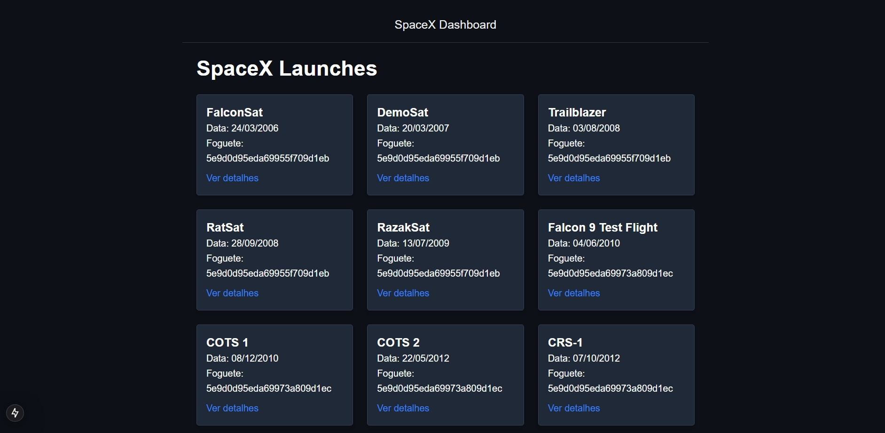

# SpaceX Rockets

> Rockets

Este projeto foi criado para demonstrar minhas habilidades em Next.js 15, utilizando as mais recentes funcionalidades do framework. Ele apresenta informações sobre lançamentos da SpaceX de forma organizada e estilizada, com um design futurista e minimalista. O objetivo principal é destacar minha capacidade de trabalhar com tecnologias modernas e criar interfaces atraentes e funcionais.

## 🚀 Tecnologias

- Next.js 15
- TypeScript
- Axios
- Tailwind CSS
- Git/Github

## 💻 O que aprendi

- Aplicação prática das novas funcionalidades do framework, como layouts aninhados e renderização com React Server Components, tornando o projeto mais modular e performático.
- Consumo da SpaceX API utilizando Axios, incluindo tratamento de erros e formatação de dados recebidos, garantindo uma comunicação eficaz com o backend.
- Desenvolvimento de um design minimalista e futurista, utilizando classes utilitárias para criar uma interface responsiva e consistente, além de explorar temas customizados para cores escuras.

## 📨 Contato

- guilhermemillerblack@gmail.com